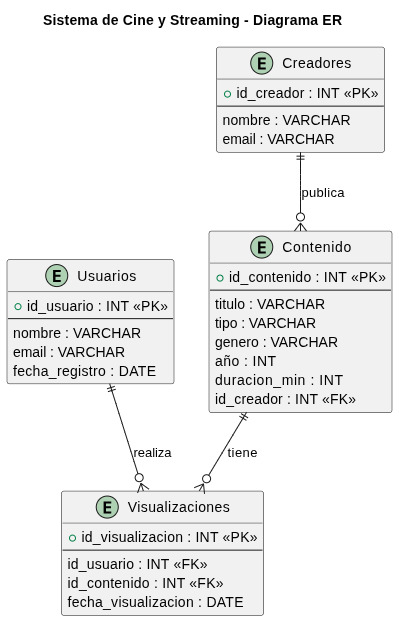

# Streaming-platform

**Streaming Service System** es una aplicación diseñada para gestionar
un catálogo de contenido audiovisual como **películas y series**,
permitiendo registrar usuarios y almacenar las visualizaciones que
realizan dentro de la plataforma.

El objetivo del proyecto es modelar y gestionar la información de un
**servicio de streaming simplificado**, similar en concepto a
plataformas como Netflix o Prime Video, pero enfocado en demostrar
conceptos fundamentales de **bases de datos relacionales, modelado de
entidades y operaciones CRUD**.

El sistema permite mantener un registro del contenido disponible, los
usuarios registrados y las interacciones entre ambos mediante el
historial de visualizaciones.

------------------------------------------------------------------------

# 🚀 Características Principales

-   **Gestión de Usuarios:** Registro y administración de usuarios
    dentro del sistema.
-   **Catálogo de Contenido:** Administración de películas y series
    disponibles en la plataforma.
-   **Historial de Visualización:** Registro de qué contenido ha visto
    cada usuario.
-   **Relaciones en Base de Datos:** Implementación de claves primarias
    y foráneas para modelar las relaciones entre entidades.
-   **Consultas Relacionales:** Posibilidad de consultar información
    combinando múltiples tablas (JOIN).

------------------------------------------------------------------------

# 🛠️ Tecnologías Utilizadas

-   **Lenguaje:** Python\
-   **Base de Datos:** PostgreSQL\
-   **Lenguaje de Consulta:** SQL\
-   **Modelado:** Diagrama Entidad-Relación (ER)

------------------------------------------------------------------------

# 📐 Modelo de Datos

El sistema se basa en **tres entidades principales**:

## 👤 Usuarios

Representa a las personas registradas en la plataforma.

-   `id_usuario` (PK)
-   `nombre`
-   `email`
-   `fecha_registro`

------------------------------------------------------------------------

## 🎥 Contenido

Almacena el catálogo de películas y series disponibles.

-   `id_contenido` (PK)
-   `titulo`
-   `tipo` (película o serie)
-   `genero`
-   `año`
-   `duracion_min`

------------------------------------------------------------------------

## ▶ Visualizaciones

Relaciona a los usuarios con el contenido que han visto.

-   `id_visualizacion` (PK)
-   `id_usuario` (FK)
-   `id_contenido` (FK)
-   `fecha_visualizacion`

------------------------------------------------------------------------
------------------------------------------------------------------------

## 🎬 Creadores

Representa a los usuarios responsables de **publicar o administrar contenido dentro de la plataforma**.  
Estos usuarios cumplen un rol similar a administradores o creadores de contenido que cargan películas o series al catálogo.

- `id_creador` (PK)
- `nombre`
- `email`

------------------------------------------------------------------------
# 🔗 Relaciones del Sistema

El modelo de datos implementa las siguientes relaciones:

- Un **creador puede publicar múltiples contenidos** dentro de la plataforma.
- Un **usuario puede visualizar múltiples contenidos**.
- Un **contenido puede ser visualizado por múltiples usuarios**.

La relación entre usuarios y contenido es **muchos a muchos** y se resuelve mediante la tabla **Visualizaciones**, que actúa como tabla intermedia registrando cada evento de visualización.
------------------------------------------------------------------------

# 🗺️ Diagrama Entidad‑Relación

A continuación se muestra el diagrama ER del sistema que representa las
entidades principales y sus relaciones.

