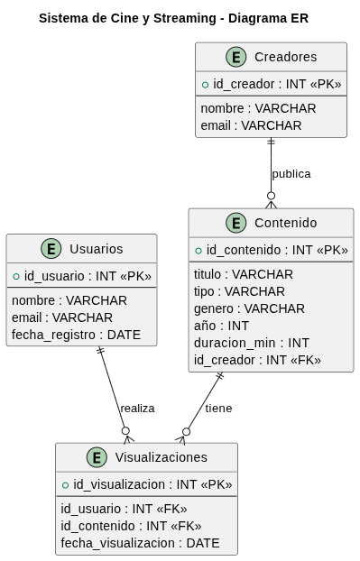

# Streaming-platform


**Streaming Service System** es una aplicación diseñada para gestionar
un catálogo de contenido audiovisual como **películas y series**,
permitiendo registrar usuarios y almacenar las visualizaciones que
realizan dentro de la plataforma.

El objetivo del proyecto es modelar y gestionar la información de un
**servicio de streaming simplificado**, similar en concepto a
plataformas como Netflix o Prime Video, pero enfocado en demostrar
conceptos fundamentales de **bases de datos relacionales, modelado de
entidades y operaciones CRUD**.

El sistema permite mantener un registro del contenido disponible, los
usuarios registrados y las interacciones entre ambos mediante el
historial de visualizaciones.

------------------------------------------------------------------------

# 🚀 Características Principales

- **Gestión de Usuarios:**  
  El sistema permite registrar y administrar los usuarios de la plataforma.  
  Cada usuario cuenta con información básica como nombre, correo electrónico y fecha de registro, lo que permite identificar quién interactúa con el sistema y mantener un historial de actividad dentro de la plataforma.

- **Gestión de Creadores de Contenido:**  
  La plataforma distingue entre usuarios que consumen contenido y creadores responsables de publicarlo.  
  Los creadores pueden registrar y administrar películas o series dentro del catálogo, permitiendo organizar quién es responsable de cada contenido disponible en la plataforma.

- **Catálogo de Contenido:**  
  El sistema permite almacenar y gestionar un catálogo de películas y series, incluyendo información como título, género, tipo de contenido y duración.  
  Cada contenido está asociado a un creador, lo que permite mantener una organización clara de quién publica cada elemento dentro de la plataforma.

- **Historial de Visualización:**  
  Se registra cada vez que un usuario visualiza un contenido.  
  Esto permite mantener un historial de visualizaciones que refleja la interacción de los usuarios con el catálogo, facilitando consultas como qué contenido fue visto, cuándo fue visualizado y qué usuarios lo consumieron.

- **Relaciones en Base de Datos:**  
  El sistema utiliza claves primarias y claves foráneas para establecer relaciones entre las diferentes entidades del modelo.  
  Esto garantiza la integridad de los datos y permite representar correctamente las relaciones entre usuarios, creadores, contenido y visualizaciones.

- **Consultas Relacionales:**  
  Gracias al uso de múltiples tablas relacionadas, el sistema permite realizar consultas que combinan información de distintas entidades mediante operaciones SQL como `JOIN`.  
  Esto facilita obtener información relevante como el historial de visualizaciones de un usuario, el contenido publicado por un creador o el contenido más visto dentro de la plataforma.

------------------------------------------------------------------------

# 🛠️ Tecnologías Utilizadas

-   **Lenguaje:** Python\ DEMO
-   **Base de Datos:** PostgreSQL\ DEMO
-   **Lenguaje de Consulta:** SQL\    DEMO
-   **Modelado:** Diagrama Entidad-Relación (ER)

------------------------------------------------------------------------

# 📐 Modelo de Datos

El sistema se basa en **tres entidades principales**:

## 👤 Usuarios

Representa a las personas registradas en la plataforma.

-   `id_usuario` (PK)
-   `nombre`
-   `email`
-   `fecha_registro`

------------------------------------------------------------------------

## 🎥 Contenido

Almacena el catálogo de películas y series disponibles.

-   `id_contenido` (PK)
-   `titulo`
-   `tipo` (película o serie)
-   `genero`
-   `año`
-   `duracion_min`

------------------------------------------------------------------------

## ▶ Visualizaciones

Relaciona a los usuarios con el contenido que han visto.

-   `id_visualizacion` (PK)
-   `id_usuario` (FK)
-   `id_contenido` (FK)
-   `fecha_visualizacion`

------------------------------------------------------------------------
------------------------------------------------------------------------

## 🎬 Creadores

Representa a los usuarios responsables de **publicar o administrar contenido dentro de la plataforma**.  
Estos usuarios cumplen un rol similar a administradores o creadores de contenido que cargan películas o series al catálogo.

- `id_creador` (PK)
- `nombre`
- `email`

------------------------------------------------------------------------
# 🔗 Relaciones del Sistema

El modelo de datos implementa las siguientes relaciones:

- Un **creador puede publicar múltiples contenidos** dentro de la plataforma.
- Un **usuario puede visualizar múltiples contenidos**.
- Un **contenido puede ser visualizado por múltiples usuarios**.

La relación entre usuarios y contenido es **muchos a muchos** y se resuelve mediante la tabla **Visualizaciones**, que actúa como tabla intermedia registrando cada evento de visualización.
------------------------------------------------------------------------

# 🗺️ Diagrama Entidad‑Relación

A continuación se muestra el diagrama ER del sistema que representa las
entidades principales y sus relaciones.



------------------------------------------------------------------------

# ⚙️ Requisitos Previos

- Python 3
- pip
- Git
- Editor de código (VS Code recomendado)

------------------------------------------------------------------------

# 🛠️ Instalación

1. Clonar el repositorio:

```bash
git clone https://github.com/Almonacid98/streaming-platform.git
cd streaming-platform
```

2. Ejecutar el script de instalación:

```bash
./install.sh
```

Este script realiza automáticamente:
- creación del entorno virtual (`streaming_env`)
- activación del entorno
- instalación de dependencias

------------------------------------------------------------------------

# ▶️ Ejecución

1. Levantar el servidor:

```bash
./boot.sh
```

Este script:
- activa el entorno virtual
- aplica migraciones
- inicia el servidor Django

2. Crear superusuario (opcional):

```bash
python manage.py createsuperuser
```

3. Acceder al sistema:

- http://127.0.0.1:8000/
- http://127.0.0.1:8000/admin/

------------------------------------------------------------------------

# 🧪 Scripts de Automatización

### 🔹 install.sh
Configura el entorno automáticamente.

```bash
./install.sh
```

### 🔹 boot.sh
Levanta el servidor Django.

```bash
./boot.sh
```

------------------------------------------------------------------------

# 🔐 Autenticación con JWT

## ¿Por qué se eligió JWT en lugar de sesiones tradicionales?

En este proyecto se implementó autenticación basada en **JSON Web Tokens (JWT)** utilizando la librería **SimpleJWT** para Django REST Framework.

Se eligió JWT sobre el sistema tradicional de sesiones por las siguientes razones:

### Ventajas de JWT

* **Arquitectura RESTful:** la API está diseñada para ser consumida por aplicaciones web, móviles o microservicios, por lo que resulta conveniente utilizar un mecanismo de autenticación independiente del estado del servidor.
* **Escalabilidad:** los tokens contienen la información necesaria para identificar al usuario, evitando almacenar sesiones activas en el servidor.
* **Desacoplamiento entre cliente y servidor:** cualquier cliente autorizado puede autenticarse enviando el token en cada solicitud HTTP.
* **Compatibilidad con microservicios:** JWT es ampliamente utilizado en arquitecturas distribuidas y facilita la comunicación segura entre servicios.
* **Mayor flexibilidad para aplicaciones frontend modernas:** permite integrar fácilmente frameworks como React, Angular o aplicaciones móviles.

### Funcionamiento

1. El usuario inicia sesión mediante el endpoint:

```http
POST /api/token/
```

2. El sistema genera:

   * **Access Token:** utilizado para acceder a recursos protegidos.
   * **Refresh Token:** utilizado para obtener nuevos access tokens cuando estos expiran.

3. El cliente envía el Access Token en el encabezado:

```http
Authorization: Bearer <token>
```

4. El servidor valida el token y autoriza la solicitud.

---

# 🚪 Logout y Blacklist de Tokens

## ¿Qué es la Blacklist?

Dado que JWT es un mecanismo **stateless**, el servidor no mantiene sesiones activas de los usuarios.

Por este motivo, cuando un usuario cierra sesión no es posible eliminar directamente un token ya emitido. Para resolver este problema se utiliza una **Blacklist de Tokens**.

La blacklist consiste en un registro de tokens revocados que ya no pueden utilizarse para obtener nuevas credenciales.

## Funcionamiento del Logout

El endpoint de cierre de sesión es:

```http
POST /api/logout/
```

El usuario envía su **Refresh Token** y el sistema:

1. Valida el token recibido.
2. Lo agrega a la blacklist.
3. Impide que vuelva a utilizarse para generar nuevos Access Tokens.

### Flujo de ejemplo

```text
Login
│
├── Access Token
└── Refresh Token
        │
        ▼
      Logout
        │
        ▼
Refresh Token → Blacklist
        │
        ▼
No puede volver a utilizarse
```

## Resultado esperado

Si un usuario intenta refrescar un token revocado:

```http
POST /api/token/refresh/
```

el sistema responde:

```http
401 Unauthorized
```

indicando que el token fue revocado correctamente.

## Beneficios

* Mayor seguridad ante robo o reutilización de tokens.
* Permite invalidar credenciales antes de su fecha de expiración.
* Implementa un mecanismo de cierre de sesión compatible con JWT.
* Facilita el control de acceso en APIs REST modernas.
